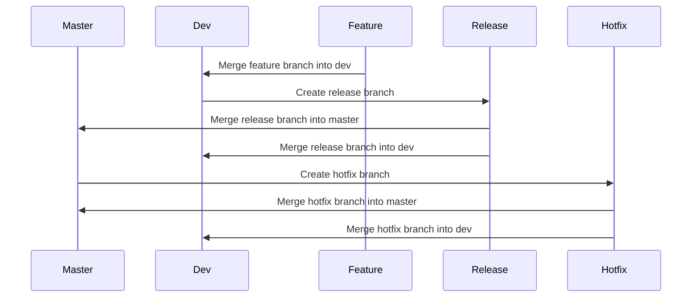
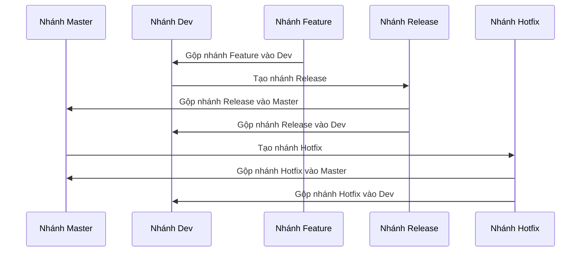

# Git Workflow with Branches: Master, Dev, Feature, Release, Hotfix

## Branching Strategy Overview
1. **Master Branch**:
   - The main branch that always contains production-ready code.
   - Only stable and tested code is merged into this branch.

2. **Dev Branch**:
   - The integration branch where all feature branches are merged.
   - Used for testing and development purposes before releasing to production.

3. **Feature Branches**:
   - Created for developing new features or enhancements.
   - Merged into the `dev` branch once the feature is complete and tested.

4. **Release Branches**:
   - Created when preparing a new release.
   - Used for final testing, bug fixes, and preparing release notes.
   - Merged into both `master` and `dev` branches after the release.

5. **Hotfix Branches**:
   - Created to fix critical issues in the production code.
   - Merged into both `master` and `dev` branches after the fix.

---

## Workflow Diagram
Below is a sequence diagram representing the Git workflow:



---

## Workflow Steps

### 1. Setting Up the Repository
```bash
git init
git remote add origin <repository-url>
git pull origin master
```

### 2. Creating and Using Branches

- **Start a New Feature**:
  ```bash
  git checkout dev
  git pull origin dev
  git checkout -b feature/<feature-name>
  # Work on the feature
  git add .
  git commit -m "Add feature <feature-name>"
  git push origin feature/<feature-name>
  ```

- **Merge Feature into Dev**:
  ```bash
  git checkout dev
  git pull origin dev
  git merge feature/<feature-name>
  git push origin dev
  ```

- **Prepare a Release**:
  ```bash
  git checkout dev
  git pull origin dev
  git checkout -b release/<version>
  # Final testing and bug fixes
  git add .
  git commit -m "Prepare release <version>"
  git push origin release/<version>
  ```

- **Merge Release into Master and Dev**:
  ```bash
  git checkout master
  git pull origin master
  git merge release/<version>
  git push origin master

  git checkout dev
  git pull origin dev
  git merge release/<version>
  git push origin dev
  ```

- **Fix a Hotfix**:
  ```bash
  git checkout master
  git pull origin master
  git checkout -b hotfix/<issue-name>
  # Fix the issue
  git add .
  git commit -m "Fix <issue-name>"
  git push origin hotfix/<issue-name>
  ```

- **Merge Hotfix into Master and Dev**:
  ```bash
  git checkout master
  git pull origin master
  git merge hotfix/<issue-name>
  git push origin master

  git checkout dev
  git pull origin dev
  git merge hotfix/<issue-name>
  git push origin dev
  ```

---

## Best Practices
1. Always pull the latest changes before starting work on a branch.
2. Use descriptive names for branches (e.g., `feature/ITB-5662-login-page`, `hotfix/ITB-5662-payment-bug`), branch names for features or hotfixes should include a corresponding prefix with the Jira ID, if available.
3. When committing, provide a clear description and avoid blank. Include a corresponding prefix with the Jira ID, if available. (e.g., `ITB-5662. Add file Korean string.xml`).
4. Test thoroughly before merging into `master` or `dev`.
5. Use pull requests for code reviews before merging.
6. Delete branches after they are merged to keep the repository clean.

This workflow ensures a structured and efficient way to manage source code in a collaborative environment.

---

## Quy trình làm việc với Git (Tiếng Việt)

### 1. Thiết lập Repository
1. Khởi tạo repository mới:
   ```bash
   git init
   ```
2. Thêm remote repository:
   ```bash
   git remote add origin <đường-dẫn-repository>
   ```
3. Kéo mã nguồn từ nhánh `master`:
   ```bash
   git pull origin master
   ```

---

### 2. Tạo và sử dụng các nhánh

- **Bắt đầu một tính năng mới (Feature)**:
  ```bash
  git checkout dev
  git pull origin dev
  git checkout -b feature/<tên-tính-năng>
  # Làm việc trên tính năng
  git add .
  git commit -m "Thêm tính năng <tên-tính-năng>"
  git push origin feature/<tên-tính-năng>
  ```

- **Gộp nhánh Feature vào Dev**:
  ```bash
  git checkout dev
  git pull origin dev
  git merge feature/<tên-tính-năng>
  git push origin dev
  ```

- **Chuẩn bị một bản phát hành (Release)**:
  ```bash
  git checkout dev
  git pull origin dev
  git checkout -b release/<phiên-bản>
  # Kiểm tra cuối cùng và sửa lỗi
  git add .
  git commit -m "Chuẩn bị phát hành <phiên-bản>"
  git push origin release/<phiên-bản>
  ```

- **Gộp nhánh Release vào Master và Dev**:
  ```bash
  git checkout master
  git pull origin master
  git merge release/<phiên-bản>
  git push origin master

  git checkout dev
  git pull origin dev
  git merge release/<phiên-bản>
  git push origin dev
  ```

- **Sửa lỗi khẩn cấp (Hotfix)**:
  ```bash
  git checkout master
  git pull origin master
  git checkout -b hotfix/<tên-vấn-đề>
  # Sửa lỗi
  git add .
  git commit -m "Sửa lỗi <tên-vấn-đề>"
  git push origin hotfix/<tên-vấn-đề>
  ```

- **Gộp nhánh Hotfix vào Master và Dev**:
  ```bash
  git checkout master
  git pull origin master
  git merge hotfix/<tên-vấn-đề>
  git push origin master

  git checkout dev
  git pull origin dev
  git merge hotfix/<tên-vấn-đề>
  git push origin dev
  ```

---

### Các nguyên tắc tốt nhất
1. Luôn kéo (pull) các thay đổi mới nhất trước khi bắt đầu làm việc trên một nhánh.
2. Sử dụng tên nhánh mô tả rõ ràng (ví dụ: `feature/ITB-5662-trang-dang-nhap`, `hotfix/ITB-5662-loi-thanh-toan`), tên nhánh feature, hotfix thêm tiền tố tương ứng với id của Jira nếu có.
3. Khi commit mô tả rõ ràng không nên để trống, thêm tiền tố tương ứng với id của Jira nếu có. (ví dụ: `ITB-5662. Add file Korean string.xml`).
4. Kiểm tra kỹ lưỡng trước khi gộp vào nhánh `master` hoặc `dev`.
5. Sử dụng pull request để xem xét mã nguồn trước khi gộp.
6. Xóa các nhánh sau khi đã gộp để giữ repository sạch sẽ.

---

### Sơ đồ quy trình làm việc
Dưới đây là sơ đồ mô tả quy trình làm việc với Git:



---

Phần này giúp bạn dễ dàng quản lý mã nguồn và làm việc nhóm hiệu quả hơn với Git.